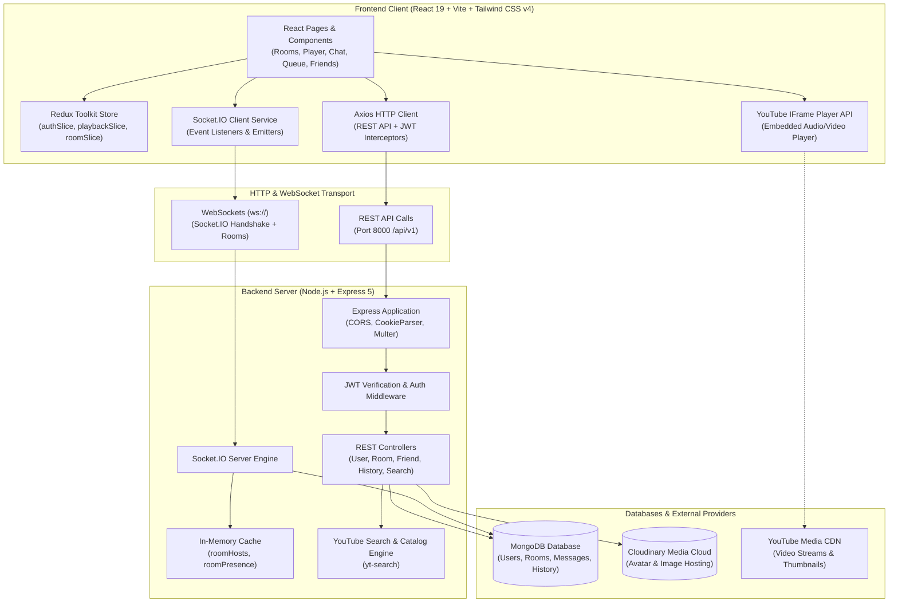
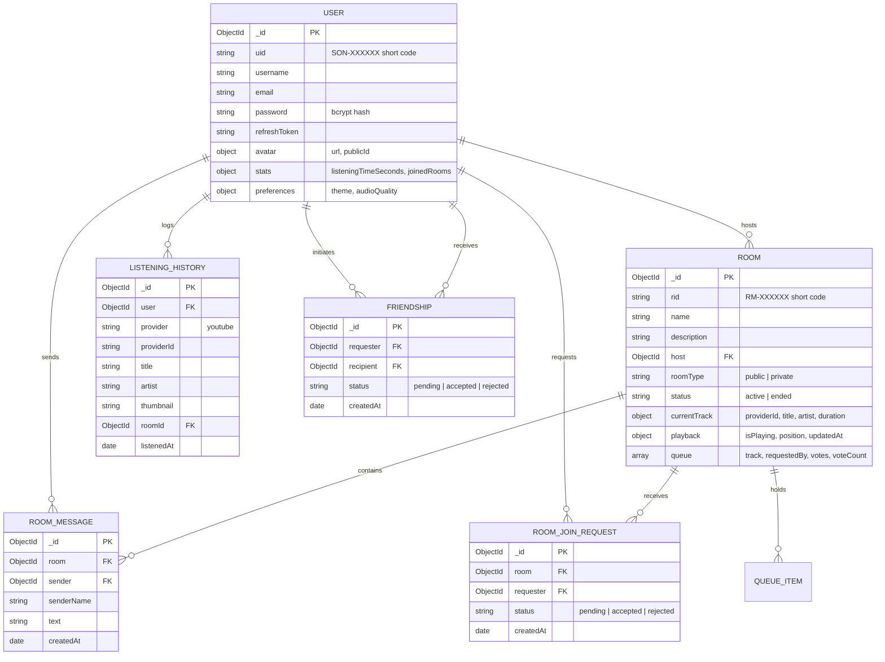
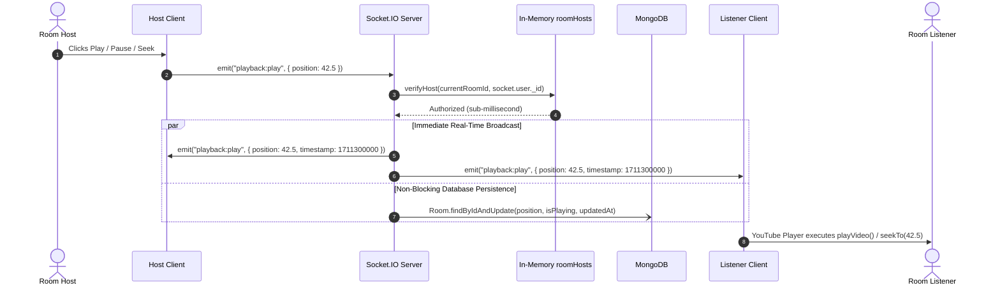
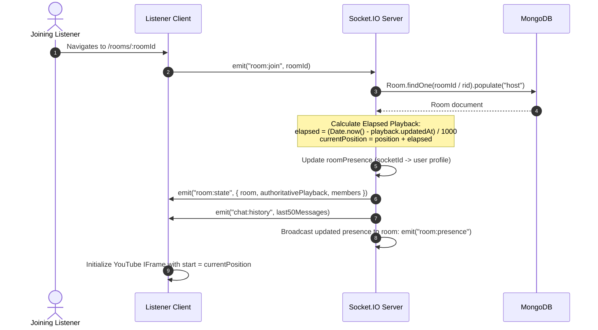
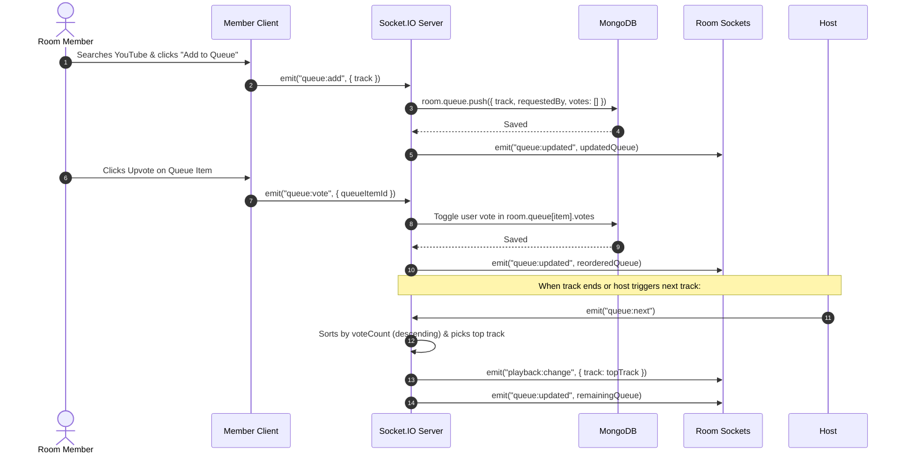
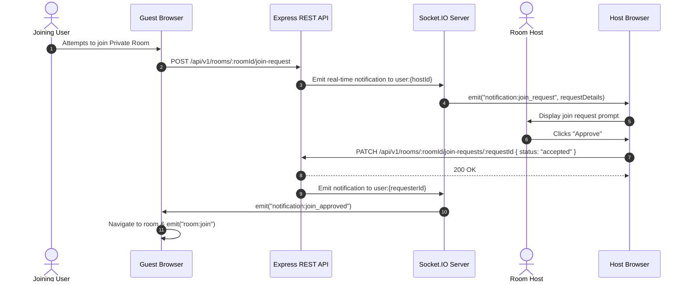
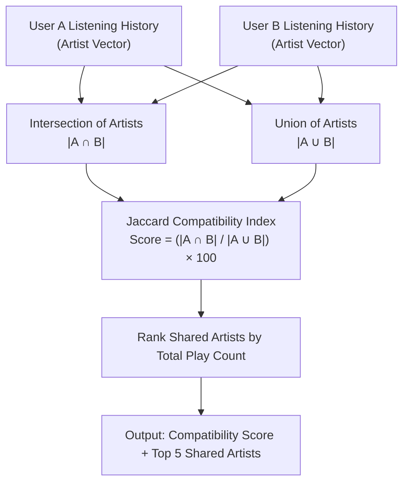

# 🎵 Sonora — Social Music Listening Platform

[](https://react.dev/)
[](https://vitejs.dev/)
[](https://tailwindcss.com/)
[](https://nodejs.org/)
[](https://expressjs.com/)
[](https://socket.io/)
[](https://www.mongodb.com/)
[](https://jwt.io/)
[](LICENSE)

> **Sonora** is a real-time, synchronized social music listening platform designed to make music streaming a collective, shared virtual experience. Create public or private listening lounges, sync playback across listeners, upvote upcoming tracks in collaborative queues, chat in real-time, and uncover musical chemistry with friends using Music DNA.

---

## 📑 Table of Contents

- [Overview](#-overview)
- [Key Features](#-key-features)
- [System Architecture](#-system-architecture)
  - [High-Level Architecture](#high-level-architecture)
  - [Frontend Architecture](#frontend-architecture)
  - [Backend Architecture](#backend-architecture)
  - [Database Schema & Data Model](#database-schema--data-model)
- [Core Workflows & Sequence Diagrams](#-core-workflows--sequence-diagrams)
  - [1. Real-Time Playback Synchronization](#1-real-time-playback-synchronization)
  - [2. Room Joining & Authoritative State Calculation](#2-room-joining--authoritative-state-calculation)
  - [3. Collaborative Queue & Upvoting](#3-collaborative-queue--upvoting)
  - [4. Private Room Knock & Approval Workflow](#4-private-room-knock--approval-workflow)
  - [5. Music DNA & Compatibility Matching](#5-music-dna--compatibility-matching)
- [Tech Stack](#-tech-stack)
- [Directory Structure](#-directory-structure)
- [API Reference](#-api-reference)
  - [Authentication & User Endpoints](#authentication--user-endpoints)
  - [Room Management Endpoints](#room-management-endpoints)
  - [Friendship & Social Endpoints](#friendship--social-endpoints)
  - [Listening History & Music DNA Endpoints](#listening-history--music-dna-endpoints)
  - [Search & Catalog Endpoints](#search--catalog-endpoints)
- [Socket.IO Real-Time Event Matrix](#-socketio-real-time-event-matrix)
- [Getting Started & Local Setup](#-getting-started--local-setup)
  - [Prerequisites](#prerequisites)
  - [1. Clone Repository](#1-clone-repository)
  - [2. Server Setup](#2-server-setup)
  - [3. Client Setup](#3-client-setup)
  - [4. Run in Development Mode](#4-run-in-development-mode)
- [Environment Variables](#-environment-variables)
- [Security, Performance & Optimization](#-security-performance--optimization)
- [Contributing & License](#-contributing--license)

---

## 🌟 Overview

Most music streaming applications are isolated, single-user experiences. Even when friends share song links or playlists, listening remains asynchronous.

**Sonora** transforms music consumption into an interactive social hangout:
- **Shared Living Rooms for Music**: Anyone can create a room with custom privacy levels, tags, and vibes. Rooms feature clean alphanumeric share codes (`RM-XXXXXX`) alongside Mongo ObjectIDs.
- **Synchronized Audio via YouTube IFrame**: Host controls (play, pause, seek, song skips) automatically propagate to all connected listeners in real-time with sub-second synchronization.
- **Democratic Listening**: Listeners don't just passively listen—they search YouTube, add candidate tracks to a shared queue, and upvote favorites to influence what plays next.
- **Social Discovery & Music DNA**: Profiles display listening metrics, favorite genres, top tracks, and calculated compatibility scores based on Jaccard similarity across listening histories.

---

## ✨ Key Features

### 🎧 Synchronized Listening Rooms
- **Host-Driven Playback Control**: The room host possesses verified authority to play, pause, seek, and switch tracks.
- **Authoritative Server Position Computation**: When late-joining listeners enter an active room, the server automatically projects current playback position based on elapsed server time:
  $$\text{Current Position} = \text{Saved Position} + \frac{\text{Server Now} - \text{Updated At}}{1000}$$
- **Fast-Path Host Authorization**: Sub-millisecond host verification using an in-memory cache (`roomHosts`), bypassing redundant database round-trips for high-frequency playback events.

### 🗳️ Democratic Queues & Real-Time Voting
- Room members can search for tracks and queue them up with live metadata.
- Upvoting mechanism toggles member votes and orders tracks dynamically by vote count.
- The host can trigger the top-voted track automatically (`queue:next`) or select specific items directly.

### 💬 Live Chat & In-Room Presence
- Real-time room messaging with sender badges and timestamps.
- Upon entering, clients automatically receive the latest 50 messages of room chat history.
- Presence tracking via in-memory Maps (`roomPresence`) tracking `userId`, `username`, and `avatar` without external infrastructure overhead.

### 🔒 Room Privacy & Join Approval Workflow
- **Public Rooms**: Open to any authenticated user from the discovery feed or via room code.
- **Private Rooms**: Closed lounges where join requests trigger real-time host notifications. The host can approve or reject applicants before access is granted.

### 🧬 Music DNA & Taste Compatibility
- Sonora records listening history across room sessions with a 60-second deduplication threshold.
- Calculates personal **Music DNA** (top artists, top genres, listening distribution, total minutes).
- Calculates a mutual **Compatibility Index (0–100%)** between two users based on Jaccard set similarity of artist listening histories.

### 👥 Social Network & Friend Management
- Search users by username or short Sonora User ID (`SON-XXXXXX`).
- Send, accept, or decline friend requests with real-time updates.
- Profile customization: Cloudinary-backed avatar uploads, bios, social links, and security settings (password reset, email change, account deletion).

---

## 🏛️ System Architecture

### High-Level Architecture



### Frontend Architecture
- **Framework & Build Tool**: React 19 bootstrapped with Vite 8 for fast HMR.
- **Routing**: `react-router-dom` v7 with role-based routing (`<ProtectedRoute>` and `<PublicRoute>`).
- **State Management**: Redux Toolkit slices:
  - `authSlice`: Current authenticated user, token states, session persistence.
  - `playbackSlice`: Active track info, playback state (`isPlaying`, `position`, `duration`), volume.
  - `roomSlice`: Active room metadata, participant presence, chat logs, and song queue.
- **Styling**: Tailwind CSS v4 featuring modern dark-themed glassmorphism, responsive grids, and custom animations.
- **Audio/Video Playback**: YouTube IFrame API wrapped in custom React hooks (`useYouTubePlayer`) with synchronization logic to eliminate player drift.

### Backend Architecture
- **Runtime**: Node.js utilizing native ES Modules (`"type": "module"`).
- **Web Framework**: Express 5 with standardized request/response wrappers (`ApiResponse`, `ApiError`, `asyncHandler`).
- **Real-Time Communication**: Socket.IO 4 with token authentication middleware in the connection handshake.
- **In-Memory Speed Layers**:
  - `roomHosts = new Map()`: Maps `canonicalRoomId` $\rightarrow$ `hostUserId` for instantaneous host checks without MongoDB queries.
  - `roomPresence = new Map()`: Tracks connected socket sessions and room member metadata.
- **External Integrations**:
  - `yt-search`: Server-side song queries returning provider IDs, titles, artists, duration, and high-res thumbnails.
  - `cloudinary` + `multer`: Image upload pipeline with automated transformation for profile avatars.

---

### Database Schema & Data Model



---

## 🔄 Core Workflows & Sequence Diagrams

### 1. Real-Time Playback Synchronization

When a host toggles playback, changes track position, or skips songs, the action broadcasts to all listeners in the room with millisecond latency:



---

### 2. Room Joining & Authoritative State Calculation

When a user joins a room in progress, Sonora calculates the exact playback offset so the joiner stays aligned with the host:



---

### 3. Collaborative Queue & Upvoting

Democratic queueing allows room members to influence the upcoming playlist:



---

### 4. Private Room Knock & Approval Workflow



---

### 5. Music DNA & Compatibility Matching

Sonora matches two users through mathematical intersection of their music history:



---

## 💻 Tech Stack

| Category | Technology | Description |
| :--- | :--- | :--- |
| **Frontend Framework** | [React 19](https://react.dev/) | Core UI rendering engine with Concurrent Features |
| **Build Tool** | [Vite 8](https://vitejs.dev/) | Next-generation frontend tooling and rapid bundling |
| **Styling** | [Tailwind CSS v4](https://tailwindcss.com/) | Modern utility-first CSS framework with native styling variables |
| **State Management** | [Redux Toolkit](https://redux-toolkit.js.org/) | Centralized store managing auth, playback, and room state |
| **Client Routing** | [React Router v7](https://reactrouter.com/) | Declarative browser routing with protected layouts |
| **Backend Framework** | [Node.js](https://nodejs.org/) & [Express 5](https://expressjs.com/) | RESTful API server with ES Module architecture |
| **Real-Time Networking**| [Socket.IO 4](https://socket.io/) | Full-duplex WebSocket communication with heartbeat and room clustering |
| **Database** | [MongoDB](https://www.mongodb.com/) via [Mongoose 9](https://mongoosejs.com/) | Document database for users, rooms, chat logs, and history |
| **Media Player** | [YouTube IFrame API](https://developers.google.com/youtube/iframe_api_reference) | Low-overhead streaming audio/video player |
| **Music Catalog Search**| [yt-search](https://www.npmjs.com/package/yt-search) | Fast YouTube query engine for songs, artists, and durations |
| **Media Storage** | [Cloudinary](https://cloudinary.com/) & [Multer](https://github.com/expressjs/multer) | Cloud media storage and image transformation for avatars |
| **Security & Auth** | [JSON Web Tokens (JWT)](https://jwt.io/) & [bcryptjs](https://github.com/dcodeIO/bcrypt.js) | Dual-token authentication (Access Token + httpOnly Refresh Cookie) |

---

## 📂 Directory Structure

```plaintext
Sonoro/
├── client/                           # React frontend application
│   ├── public/                       # Static public assets
│   ├── src/
│   │   ├── assets/                   # Vector graphics, logos, icons
│   │   ├── components/               # Modular UI components
│   │   │   ├── auth/                 # ProtectedRoute, PublicRoute, AuthForm
│   │   │   ├── discover/             # Track search, AddTrackModal, GenrePills
│   │   │   ├── home/                 # Hero sections, activity feeds, quick join
│   │   │   ├── room/                 # RoomChat, RoomQueue, YouTubePlayer, MembersList
│   │   │   ├── solo/                 # Personal music player controls
│   │   │   └── ui/                   # Reusable buttons, modals, badges, inputs
│   │   ├── constants/                # API endpoints, route mappings, player constants
│   │   ├── context/                  # React Context providers (theme, notifications)
│   │   ├── hooks/                    # Custom hooks (useAuth, useSocket, useYouTubePlayer)
│   │   ├── layouts/                  # AppLayout, Navbar, Sidebar, PlayerLayout
│   │   ├── pages/                    # Route pages (HomePage, RoomPage, FriendsPage, etc.)
│   │   ├── services/                 # Axios API clients, Socket.IO singleton instance
│   │   ├── store/                    # Redux Toolkit store & feature slices
│   │   └── utils/                    # Time formatters, string helpers, error parsers
│   ├── package.json                  # Client dependencies & build scripts
│   └── vite.config.js                # Vite build and plugin configuration
│
├── server/                           # Express + Socket.IO backend
│   ├── public/                       # Static files & local uploads
│   ├── src/
│   │   ├── constants/                # App-wide constants, cookie configs, defaults
│   │   ├── controllers/              # Route handlers (user, room, friendship, history, search)
│   │   ├── db/                       # MongoDB connection lifecycle management
│   │   ├── middlewares/              # JWT auth verification, error handling, 404
│   │   ├── models/                   # Mongoose schemas (User, Room, Message, History, etc.)
│   │   ├── providers/                # YouTube search adapters & curated catalog seeders
│   │   ├── routes/                   # Express API route modules
│   │   ├── socket/                   # Socket.IO connection handling & real-time events
│   │   └── utils/                    # ApiError, ApiResponse, asyncHandler, idGenerator
│   ├── .env.example                  # Server environment variable template
│   ├── package.json                  # Backend dependencies & scripts
│   └── index.js                      # Application bootstrap & HTTP/WS listener
│
└── README.md                         # Complete project documentation
```

---

## 📡 API Reference

Base URL: `http://localhost:8000/api/v1`

### Authentication & User Endpoints

| Method | Endpoint | Auth | Description |
| :--- | :--- | :---: | :--- |
| `POST` | `/users/register` | No | Register a new user account |
| `POST` | `/users/login` | No | Authenticate user, returns access token + refresh cookie |
| `POST` | `/users/refresh-token` | Cookie | Rotate and refresh access token |
| `POST` | `/users/logout` | Yes | Invalidate refresh token and clear cookies |
| `GET` | `/users/me` | Yes | Fetch profile of currently authenticated user |
| `PATCH`| `/users/me/profile` | Yes | Update profile bio, avatar (multipart form upload) |
| `GET` | `/users/me/stats` | Yes | Get personal listening statistics and room metrics |
| `GET` | `/users/me/settings` | Yes | Retrieve user settings and preferences |
| `PATCH`| `/users/me/settings` | Yes | Update user settings and preferences |
| `POST` | `/users/me/change-password` | Yes | Change current password |
| `GET` | `/users/search?q={query}` | Yes | Search users by username or `SON-XXXXXX` UID |
| `GET` | `/users/:username` | No | Retrieve public profile of specified user |

### Room Management Endpoints

| Method | Endpoint | Auth | Description |
| :--- | :--- | :---: | :--- |
| `POST` | `/rooms` | Yes | Create a new public or private room |
| `GET` | `/rooms` | Yes | List active public listening rooms |
| `GET` | `/rooms/search?q={term}` | Yes | Search active rooms by title, tag, or `RM-XXXXXX` |
| `GET` | `/rooms/mine` | Yes | Get rooms hosted by current user |
| `GET` | `/rooms/:roomId` | Yes | Get room details, authoritative playback & members |
| `PATCH`| `/rooms/:roomId/end` | Yes | End room session (host only) |
| `POST` | `/rooms/:roomId/join-request` | Yes | Request to join a private room |
| `GET` | `/rooms/:roomId/join-requests` | Yes | View pending join requests (host only) |
| `PATCH`| `/rooms/:roomId/join-requests/:requestId` | Yes | Accept or reject join request (host only) |

### Friendship & Social Endpoints

| Method | Endpoint | Auth | Description |
| :--- | :--- | :---: | :--- |
| `GET` | `/friends` | Yes | Get list of accepted friends |
| `POST` | `/friends/request` | Yes | Send friend request by recipient username or ID |
| `PATCH`| `/friends/respond` | Yes | Accept or decline a pending friend request |
| `GET` | `/friends/pending` | Yes | List incoming and outgoing pending requests |
| `GET` | `/friends/compatibility/:userId` | Yes | Calculate Music DNA compatibility score with user |
| `DELETE`| `/friends/:friendshipId` | Yes | Remove friend or cancel request |

### Listening History & Music DNA Endpoints

| Method | Endpoint | Auth | Description |
| :--- | :--- | :---: | :--- |
| `POST` | `/history` | Yes | Record a song listen event (deduplicated 60s) |
| `POST` | `/history/time` | Yes | Increment user's total listening duration (seconds) |
| `GET` | `/history?limit={n}` | Yes | Fetch user's recent listening history |
| `GET` | `/history/dna` | Yes | Compute personal Music DNA analytics |

### Search & Catalog Endpoints

| Method | Endpoint | Auth | Description |
| :--- | :--- | :---: | :--- |
| `GET` | `/search?q={query}` | No | Search tracks via YouTube search provider |
| `POST` | `/search/tracks` | Yes | Add custom track directly to Sonora database |

---

## 🔌 Socket.IO Real-Time Event Matrix

### Client-to-Server Events

| Event Name | Payload | Auth | Description |
| :--- | :--- | :---: | :--- |
| `room:join` | `roomId` (string) | JWT | Join room room channel, receive authoritative state & presence |
| `room:leave` | *(none)* | JWT | Leave current room; if host leaves, room status is set to ended |
| `playback:play` | `{ position: number }` | Host | Start playback at specified position |
| `playback:pause`| `{ position: number }` | Host | Pause playback at specified position |
| `playback:seek` | `{ position: number }` | Host | Seek playback to timestamp (seconds) |
| `playback:change`| `{ track: Object }` | Host | Switch active playing track |
| `queue:add` | `{ track: Object }` | Member | Push candidate track to room queue |
| `queue:vote` | `{ queueItemId: string }` | Member | Upvote or remove upvote on queued track |
| `queue:next` | `{ queueItemId?: string }`| Host | Play specific track or top-voted queue item |
| `chat:message` | `{ text: string }` | Member | Send text message to room chat channel (max 500 chars) |

### Server-to-Client Events

| Event Name | Payload | Description |
| :--- | :--- | :--- |
| `room:state` | `{ room, authoritativePlayback, members }` | Initial synchronization payload sent upon joining |
| `room:presence` | `Array<Member>` | Real-time active member list update |
| `room:member_left`| `{ roomId, userId, username }` | Notification when a member exits |
| `room:host_left` | `{ roomId, message }` | Broadcast when room host departs or room terminates |
| `playback:play` | `{ position, timestamp }` | Broadcast to sync play state across listeners |
| `playback:pause`| `{ position, timestamp }` | Broadcast to freeze playback position |
| `playback:seek` | `{ position, timestamp }` | Broadcast to seek player position |
| `playback:change`| `{ track, timestamp }` | Broadcast when current song is switched |
| `queue:updated` | `Array<QueueItem>` | Emitted when items are added, voted, or removed |
| `chat:message` | `{ _id, senderName, senderId, text, createdAt }` | Broadcast incoming chat message |
| `chat:history` | `Array<RoomMessage>` | Last 50 messages delivered upon joining room |
| `error` | `{ message: string, isPrivate?: boolean }` | Emitted when an action is unauthorized or invalid |

---

## 🚀 Getting Started & Local Setup

### Prerequisites
- [Node.js](https://nodejs.org/) v18.0.0 or higher
- [MongoDB](https://www.mongodb.com/) instance (local or MongoDB Atlas connection string)
- [Cloudinary](https://cloudinary.com/) account (optional, for avatar uploads)

---

### 1. Clone Repository

```bash
git clone https://github.com/Rishabh-Trivedi7/Sonoro.git
cd Sonoro
```

---

### 2. Server Setup

Navigate into the `server/` directory and install dependencies:

```bash
cd server
npm install
```

Create a `.env` file from `.env.example`:

```bash
cp .env.example .env
```

Configure your environment variables inside `server/.env`:

```env
PORT=8000
MONGODB_URI=mongodb://localhost:27017/sonora
CORS_ORIGIN=http://localhost:5173

ACCESS_TOKEN_SECRET=your_super_secret_access_token_key_here
ACCESS_TOKEN_EXPIRY=1d
REFRESH_TOKEN_SECRET=your_super_secret_refresh_token_key_here
REFRESH_TOKEN_EXPIRY=10d
REFRESH_TOKEN_COOKIE_NAME=sonora_refresh_token

# Cloudinary (Optional, for avatar uploads)
CLOUDINARY_CLOUD_NAME=your_cloudinary_cloud_name
CLOUDINARY_API_KEY=your_cloudinary_api_key
CLOUDINARY_API_SECRET=your_cloudinary_api_secret
```

---

### 3. Client Setup

Open a separate terminal, navigate into `client/`, and install dependencies:

```bash
cd ../client
npm install
```

Create a `.env` file from `.env.example`:

```bash
cp .env.example .env
```

Ensure the backend URL matches:

```env
VITE_API_BASE_URL=http://localhost:8000/api/v1
```

---

### 4. Run in Development Mode

#### Terminal 1 — Start Server:
```bash
cd server
npm run dev
```
> Server runs on `http://localhost:8000` with nodemon auto-reload.

#### Terminal 2 — Start Client:
```bash
cd client
npm run dev
```
> Vite dev server opens on `http://localhost:5173`. Open this URL in your browser.

---

## 🔐 Environment Variables

### Backend (`server/.env`)

| Variable | Required | Default | Description |
| :--- | :---: | :---: | :--- |
| `PORT` | No | `8000` | Port on which Express and Socket.IO listen |
| `MONGODB_URI` | **Yes** | — | MongoDB Atlas or local MongoDB connection URI |
| `CORS_ORIGIN` | **Yes** | `http://localhost:5173` | Allowed origin for frontend client requests |
| `ACCESS_TOKEN_SECRET` | **Yes** | — | HMAC secret used for signing JWT access tokens |
| `ACCESS_TOKEN_EXPIRY` | No | `1d` | Lifetime of the short-lived access token |
| `REFRESH_TOKEN_SECRET` | **Yes** | — | Secret used for generating refresh tokens |
| `REFRESH_TOKEN_EXPIRY` | No | `10d` | Expiration duration for refresh tokens |
| `REFRESH_TOKEN_COOKIE_NAME`| No | `sonora_refresh_token`| Cookie key used for httpOnly refresh tokens |
| `CLOUDINARY_CLOUD_NAME` | No | — | Cloudinary cloud identifier |
| `CLOUDINARY_API_KEY` | No | — | Cloudinary API key for authentication |
| `CLOUDINARY_API_SECRET` | No | — | Cloudinary secret key |

### Frontend (`client/.env`)

| Variable | Required | Default | Description |
| :--- | :---: | :---: | :--- |
| `VITE_API_BASE_URL` | **Yes** | `http://localhost:8000/api/v1` | Root URL for backend REST API requests |

---

## 🛡️ Security, Performance & Optimization

1. **Dual-Token Authentication with Rotation**:
   - Access tokens are short-lived and sent in the `Authorization: Bearer <token>` header.
   - Refresh tokens are stored in secure, `httpOnly`, `SameSite` cookies, protecting against XSS token harvesting.
   - Socket handshakes authenticate directly via JWT tokens in handshake auth headers.

2. **In-Memory Host Authorization**:
   - High-frequency events (`playback:seek`, `playback:play`, `playback:pause`) check room host authority via the in-memory `roomHosts` cache. This reduces database queries during continuous playback operations to zero.

3. **Non-Blocking Persistence**:
   - Real-time events broadcast immediately to connected room sockets (`io.to(roomId).emit(...)`) before asynchronously persisting playback state to MongoDB, ensuring near-zero perceived latency.

4. **Drift Compensation & Authoritative Clocking**:
   - Playback events carry authoritative server timestamps (`Date.now()`). Clients calculate lag and adjust YouTube player time dynamically if drift exceeds the acceptable sync deadband.

5. **Listen Deduplication**:
   - Listening history writes are debounced with a 60-second window to prevent artificial play count inflation from rapid song restarts.

---

## 🤝 Contributing

Contributions, issues, and feature requests are welcome!
1. Fork the Project
2. Create your Feature Branch (`git checkout -b feature/AmazingFeature`)
3. Commit your Changes (`git commit -m 'Add some AmazingFeature'`)
4. Push to the Branch (`git push origin feature/AmazingFeature`)
5. Open a Pull Request

---

## 📄 License

This project is licensed under the [ISC License](LICENSE).
